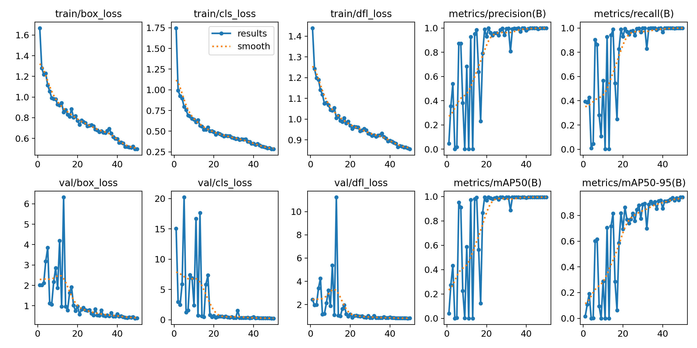
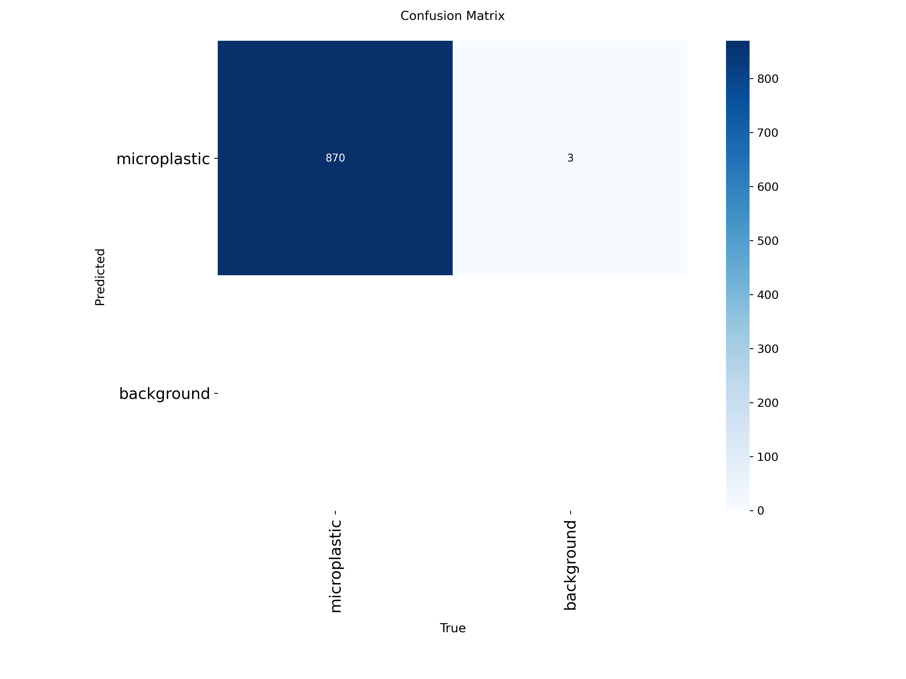
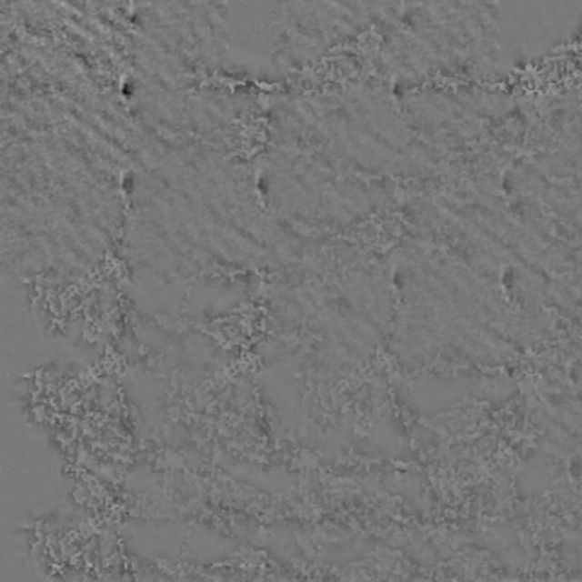
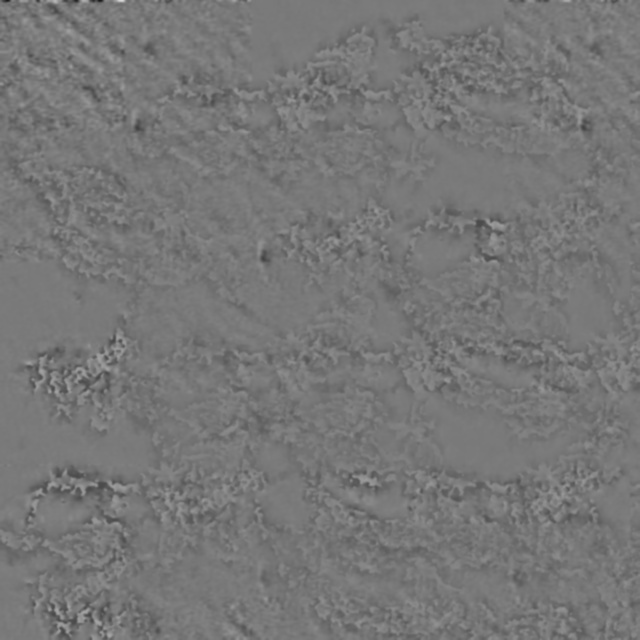
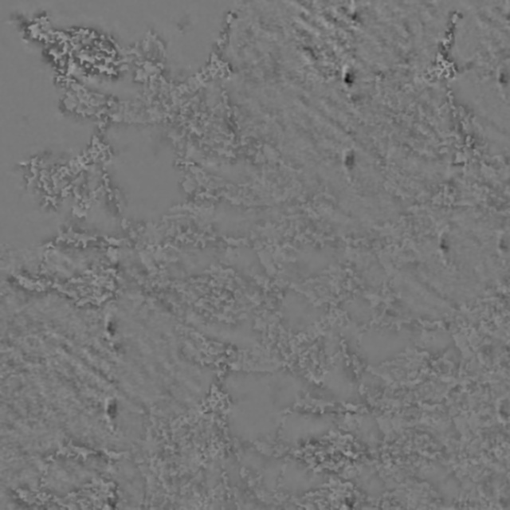
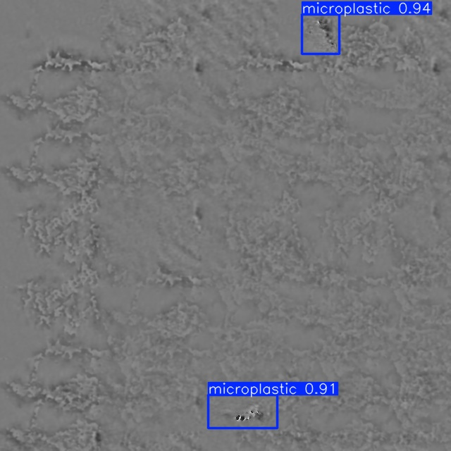

# Automated Microplastic Detection using Deep Learning

YOLOv8-nano model trained on synthetic holographic microplastic dataset. Contributes to **SDG Goal 6: Clean Water and Sanitation**.

[](https://www.python.org/downloads/)
[](https://github.com/ultralytics/ultralytics)
[](LICENSE)

## Quick Start

**Complete Setup Guide:** See [docs/setup.md](docs/setup.md) for detailed step-by-step instructions.

**Note:** The repository includes a pre-trained model. You can run inference immediately without downloading datasets. Datasets are only needed for retraining.

### Option 1: Google Colab with T4 GPU (Recommended)
1. Open [`colab_train.ipynb`](colab_train.ipynb)
2. Upload to Google Colab
3. Runtime → Change runtime type → T4 GPU
4. Run all cells

**Training Time:** ~2-3 hours on T4 GPU (50 epochs)

### Option 2: Local Training
```bash
pip install ultralytics opencv-python pandas tqdm

# Download datasets (see Dataset Download section below)
# Extract HMPD-Gen.zip and microplastic_data.zip

# Generate dataset
python 01_generate_synthetic_dataset.py

# Train model
python 02_train_yolov8_colab.py
```

### Option 3: Run Inference Only (No Training)
```bash
pip install ultralytics opencv-python flask

# Use pre-trained model for detection
python 03_esp32_integration.py --esp32 192.168.4.1 --conf 0.35
```

## Project Structure

```
├── docs/
│   └── setup.md                      # Complete setup guide for beginners
├── esp32_code/                       # ESP32-CAM Arduino code
│   ├── microplastic_detector.ino    # Main sketch
│   ├── app_httpd.cpp                # HTTP streaming server
│   ├── app_httpd.h                  # Server header
│   └── camera_pins.h                # Pin definitions
├── colab_train.ipynb                 # Google Colab training notebook
├── 01_generate_synthetic_dataset.py  # Dataset generation script
├── 02_train_yolov8_colab.py          # Training script
├── 03_esp32_integration.py           # Real-time detection with ESP32-CAM
├── yolov8_microplastic_trained.pt    # Trained model weights (3.2M params, 6MB)
├── confusion_matrix.png              # Classification accuracy matrix
├── results.png                       # Training metrics graphs (loss, mAP, precision, recall)
├── test_results/                     # 20 sample detection images with predictions
│   ├── result_01_microplastic_synthetic_00817.jpg
│   ├── result_02_microplastic_synthetic_01500.jpg
│   └── ... (18 more examples)
├── README.md                         # This file
├── LICENSE                           # MIT License
└── CITATION.cff                      # Citation metadata
```

## Dataset

**Training Data:** 15,106 holographic patches from HMPD dataset (both `gt.csv` and `gtPossible.csv`)  
**Synthetic Dataset:** 2,000 images (640×640) with 1-8 particles per scene  
**Source:** [HMPD Repository](https://github.com/beppe2hd/HMPD) by CNR-ISASI

**Paper:** *Cacace, T., Del-Coco, M., Carcagnì, P., Cocca, M., Paturzo, M., & Distante, C. (2023). "HMPD: A Novel Dataset for Microplastics Classification with Digital Holography." In Image Analysis and Processing – ICIAP 2023 (pp. 123-133). Springer-Verlag. [https://doi.org/10.1007/978-3-031-43153-1_11](https://doi.org/10.1007/978-3-031-43153-1_11)*

### Dataset Download

The training dataset files are hosted in [GitHub Releases](https://github.com/niloydebbarma-code/microplastic-detection/releases):

**Download the dataset files:**
- [HMPD-Gen.zip](https://github.com/niloydebbarma-code/microplastic-detection/releases/download/v1.0.0/HMPD-Gen.zip) (151 MB) - Holographic microplastic dataset
- [microplastic_data.zip](https://github.com/niloydebbarma-code/microplastic-detection/releases/download/v1.0.0/microplastic_data.zip) (161 MB) - Processed synthetic dataset

**Extract the datasets:**

```bash
# Download (use browser or wget/curl)
wget https://github.com/niloydebbarma-code/microplastic-detection/releases/download/v1.0.0/HMPD-Gen.zip
wget https://github.com/niloydebbarma-code/microplastic-detection/releases/download/v1.0.0/microplastic_data.zip

# Extract in project root
unzip HMPD-Gen.zip
unzip microplastic_data.zip

# Or on Windows (PowerShell)
Expand-Archive HMPD-Gen.zip -DestinationPath .
Expand-Archive microplastic_data.zip -DestinationPath .
```

**Note:** The pre-trained model `yolov8_microplastic_trained.pt` is included in the repository, so you can run inference immediately without downloading datasets.

## Model Performance

- **Architecture:** YOLOv8-nano (3.2M parameters)
- **Training:** 50 epochs on T4 GPU (~2-3 hours)
- **Detection Range:** 10-500 μm microplastic particles
- **Input Size:** 640×640 pixels

### Confidence Thresholds

**Training Validation:** `conf=0.25` (default for model evaluation)
- Used during training to measure model performance
- Lower threshold captures more detections for comprehensive metrics
- Evaluates model's ability to detect particles at various confidence levels

**Real-time Inference:** Configurable via `--conf` parameter
- **Default:** `conf=0.25` (balanced - more detections, may include false positives)
- **Recommended for production:** `conf=0.35` (balanced precision and detection rate)
- Optimized threshold reduces false alarms while maintaining good detection

```bash
# Use optimal confidence for accurate real-time detection
python 03_esp32_integration.py --esp32 192.168.4.1 --conf 0.35
```

## Training Results & Visualization

### Performance Graphs

**`results.png`** - Training metrics over 50 epochs:
- **Loss curves**: Training/validation loss (box, class, DFL losses)
- **mAP50**: Mean Average Precision at IoU threshold 0.5
- **mAP50-95**: mAP averaged across IoU thresholds 0.5 to 0.95
- **Precision**: Ratio of true positives to all positive predictions
- **Recall**: Ratio of detected particles to all ground truth particles


*Training and validation metrics showing model convergence over 50 epochs*

**`confusion_matrix.png`** - Classification accuracy analysis:
- Shows true positives, false positives, false negatives for microplastic detection
- Diagonal values indicate correct detections
- Off-diagonal values show misclassifications
- Background class performance also included


*Classification accuracy matrix showing model detection performance*

### Example Detections

The `test_results/` folder contains **20 sample detection images** showing:
- Bounding boxes around detected microplastic particles
- Confidence scores for each detection (calibrated to 0.35 threshold)
- Particle size estimates (10-500 μm range)
- Detection performance on synthetic holographic images

**Example files:**
- `result_01_microplastic_synthetic_00817.jpg` through `result_20_microplastic_synthetic_01666.jpg`
- Each shows model predictions overlaid on test images
- Demonstrates detection accuracy across different particle counts and sizes

<div style="display: flex; flex-wrap: wrap; gap: 10px;">
  
  
  
  
</div>

*Sample detection results showing bounding boxes and confidence scores*

### Dataset Split

- **Training Set**: 14,000 images from 15,106 HMPD holographic patches
- **Validation Set**: 1,106 images for model evaluation
- **Synthetic Data**: 2,000 generated images (640×640) with 1-8 particles per scene
- **Augmentation**: Rotation, brightness, contrast variations applied during training

## Citation

If you use this work, please cite:

```bibtex
@software{microplastic_detection_2026,
  title = {Automated Microplastic Detection and Quantification using Deep Learning},
  author = {Niloy Deb Barma and Godugula Tejasi},
  year = {2026},
  publisher = {GitHub},
  url = {https://github.com/niloydebbarma-code/microplastic-detection}
}
```

## Contributors

- Niloy Deb Barma ([niloydebbarma-code](https://github.com/niloydebbarma-code))
- Godugula Tejasi ([godugulatejaswi](https://github.com/godugulatejaswi))

## Supervisors

- Dr. P. Sathyaseelan, Associate Professor
- Dr. M. R. Arun, Professor

**Dataset Citation:**
```bibtex
@inproceedings{10.1007/978-3-031-43153-1_11,
  author = {Cacace, Teresa and Del-Coco, Marco and Carcagn\`{\i}, Pierluigi and Cocca, Mariacristina and Paturzo, Melania and Distante, Cosimo},
  title = {HMPD: A Novel Dataset for Microplastics Classification with Digital Holography},
  year = {2023},
  isbn = {978-3-031-43152-4},
  publisher = {Springer-Verlag},
  address = {Berlin, Heidelberg},
  url = {https://doi.org/10.1007/978-3-031-43153-1_11},
  doi = {10.1007/978-3-031-43153-1_11},
  booktitle = {Image Analysis and Processing – ICIAP 2023: 22nd International Conference, ICIAP 2023, Udine, Italy, September 11–15, 2023, Proceedings, Part II},
  pages = {123–133},
  numpages = {11},
  keywords = {dataset, microplastic, holography, deep learning},
  location = {Udine, Italy}
}
```

## Acknowledgments

- **HMPD Dataset**: CNR-ISASI for holographic microplastic dataset
- **Ultralytics**: YOLOv8 framework
- **SDG 6.3**: Clean water and sanitation
- **Component/financial support (non-coding)**: S. Yoga Lakshmi, Chavali Pavan Siva Sri Balaji, L. Santhosh

## License

MIT License - See [LICENSE](LICENSE) file for details.

Found a bug or want to contribute? Open an issue or pull request!

## Contact

For questions or collaborations, please open an issue on GitHub.

---

**Keywords:** Microplastic Detection, Digital In-Line Holography, Lensless Imaging, YOLOv8, ESP32-CAM, Water Quality Monitoring, Frugal Science, SDG 6.3, Computer Vision, Environmental 

---
